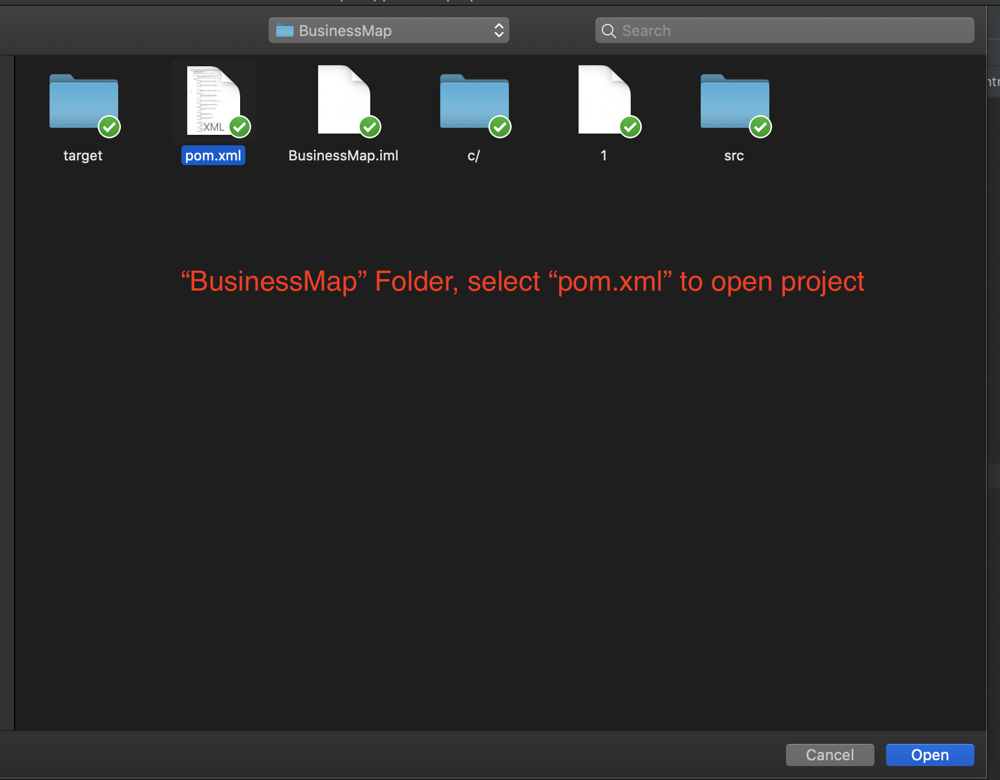

# CS39-4-My-NSW-Business-Map
The is the Github for USYD Captstone project 


## 1. Open Project



Using IDEA, open project find **pom.xml**  and open as Project

## 2. Properties fils

**pom.xml && application.properties**

default **port: 8080**

Configure MongoDB at **application.properties**


## 3. Compile

open terminal  input command:

```
mvn clean package -Dmaven.test.skip=true
```

- **Build Success**


- **Compile files path**


**target/NSW-SmallBusniess-Project-1.0.2_DEV.jar**

## 4. Running

Input command into terminal:

```
java -jar NSW-SmallBusniess-Project-1.0.2_DEV.jar
```


## 5. Open Webpage URL:

Browse Website:

localhost:8080/index


[http://www.nswbusinessmap.tk:81/](http://www.nswbusinessmap.tk:81/)
